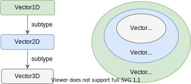

# Effective TypeScript

## 把类型看作值的集合
把 TypeScript 中的类型看作一组可能的值的集合，这有助于你更好的理解 TypeScript 中的类型和类型操作。

例如，你可以把 `number` 类型看成是所有数值的集合。`42` 和 `-37` 都在其中，但是 `'hello'` 不在其中。根据是否设置 `strictNullChecks`，`null` 和 `undefined` 可能是也可能不是这个集合的一部分：
```ts
let num: number = 42 // ok
num = -37 // ok
num = 'hello' // ~ Type string is not assignable to type number
```

最小的集合是空集，它对应于 TypeScript 中的 `never` 类型。因为空集不包含任何值，所以任何值都不能赋值给一个具有 `never` 类型的变量：
```ts
const x: never = 12 // ~ Type '12' is not assignable to type 'never'
```

其次最小的集合就是只包含一个值的集合，这对应于 TypeScript 中的字面类型(literal type），例如：
```js
type A = 'A'
type B = 'B'
type Three = 3
```
可以将多个集合求并集生成一个新的集合，这对应于 TypeScript 中的联合类型，类型操作 `|` 可以理解为集合求并集操作：
```ts
type AB = 'A' | 'B'
type AB3 = 'A' | 'B' | 3
```
类型 B 能赋给（assignable to）类型 A，当且仅当类型 B 代表的集合是类型 A 代表的集合的子集（subset），实际上，这正是 TypeScript 的类型检查的本质：
```ts
const ab: AB = Math.random() > 0.5 ? 'A' : 'B' // OK, {"A", "B"} 是 {"A", "B"} 的子集
const ab3: AB3 = ab // OK, {"A", "B"} 是 {"A", "B", 3} 的子集

declare let three: AB3
const back: AB = three // Error, {"A", "B", 3} 不是 {"A", "B"} 的子集
```
上面这些例子都很容易理解，因为这些类型代表的集合都是有限集，但是在实际场景中我们用到的类型很多是无限集，要理解这些类型和类型操作，就不那么容易。例如：
```ts
interface Identified {
  id: string
}
```
这个 interface 定义的集合就是一个无限集，它描述的是集合里的每个元素的形状，即必须包含一个 `id` 属性，且这个属性的值的类型必须是 `string` 类型的子集。也就是说，只要一个对象满足这一点，它就属于这个集合，即使它还包含额外的属性。

理解了这一点可以帮助你更好的理解在这些类型上的类型操作：
```ts
interface Person {
  name: string
}
interface Lifespan {
  birth: Date
  death?: Date
}
type PersonSpan = Person & Lifespan
```
`&` 操作符用来计算两个类型的交集，那么哪些值是属于 `PersonSpan` 类型呢？咋一看，`Person` 和 `Lifespan` 没有相同的属性，所以它们的交集应该是空集。是这样吗？

答案是否定的，首先，我们要弄清楚类型操作是作用在**值的集合**上，而不是类型定义的属性上，其次，一个包含额外属性（类型定义里声明的属性之外的属性）的值同样属于这个类型的集合。所以在上面的例子中，如果一个值同时包含 `Person` 和 `Lifespan` 的属性，那么它就属于 `PersonSpan` 类型：
```ts
const ps: PersonSpan = {
  name: 'Alan Turing',
  birth: new Date('1912/06/23'),
  death: new Date('1954/06/07')
} // Ok
```
 一般的规则是，多个 interface 的交叉类型（intersection type）中的值所包含的属性，是这每个组成的 interface 中的属性的联合（union）。可以用下面的公式来表达：
 ```ts
 keyof (A & B) = (keyof A) | (keyof B) // (1)
 ```
 这很容易理解，也是符合直觉的。但是对于多个 interface 的联合类型（union type）来说，就有点绕了：
 ```ts
type K = keyof (Person | Lifespan) // type K = never
 ```
 为什么是 `never`？前面我们说过联合操作 `|` 相当于求并集，`Person | Lifespan` 所代表的集合由所有属于 `Person` 的值和所有属于 `Lifespan` 值组成，例如：
 ```ts
const p1 = { name: 'Rose' }
const p2 = { name: 'Monica', age: 23 }
const l1 = {
  birth: new Date('1932/06/23'),
  death: new Date('1992/03/21')
}
const l2 = {
  birth: new Date('1912/06/23'),
  death: new Date('1952/03/21'),
  gender: 'male'
}

let p: Person | Lifespan = p1 // Ok
p = p2 // Ok
p = l1 // Ok
p = l2 // Ok
 ```
可以看到 `p1`，`p2`，`l1`，`l2` 都属于 `Person | Lifespan` 类型，但是由于 `Person` 和 `Lifespan` 的接口定义中所描述的属性没有重叠的部分，所以 TypeScript 无法找到某一个属性是 `Person | Lifespan` 这个集合中的每一个值都包含的，例如上面的 `p1`，`p2` 和 `l1`，`l2` 之间没有共同的属性，但是他们都属于 `Person | Lifespan`，所以 TypeScript 推断出 `keyof (Person | Lifespan)` 是空集，即 `never`。

更通用的规则，也可以用下面的公式来表达：
```ts
keyof (A | B) = (keyof A) & (keyof B) // (2)
```
如果你能对 (1)，(2) 这两个公式建立直觉，那么你就朝着深入理解 TypeScript 的类型系统前进了一大步。

另一个表达 `PersonSpan` 类型的方法是使用 `extends`：
```ts
interface Person {
  name: string
}
interface PersonSpan extends Person {
  birth: Date
  death?: Date
}
```
如果把类型看作值的集合，那这里的 `extends` 该如何理解？很简单，`A extends B`，可以直接理解为 `A` 是 `B` 的子集（subset）。`PersonSpan` 中的值必须包含 `name` 属性且它的值是个 `string`，同时也必须包含 `birth` 属性。所以 `PersonSpan` 是一个符合要求的子集。你可能还听过子类型（subtype）的说法，它和这里子集（subset）表达的意思相同。看下面的例子：
```ts
interface Vector1D { x: number }
interface Vector2D extends Vector1D { y: number }
interface Vector3D extends Vector2D { z: number }
```
这里你可以说 `Vector3D` 是 `Vector2D` 的子类型，`Vector2D` 又是 `Vector1D` 的子类型，从集合的角度，可以用韦恩图形象的描述它们之间的关系：


我们上面都是针对对象类型使用集合的概念进行解释，如果是字面类型（literal type）以及它们的联合类型，采用集合的解释会更加直观。`extends` 也可做为泛型的约束出现，在这种场景下，它也是子集（subset）的意思：
```ts
function getKey<K extends string>(val: any, key: K) {
  // ...
}
```
这里的 `extends string` 是什么意思？如果你从对象继承的角度来思考，那就很难解释，而如果从集合的角度来考虑，就很清楚了：`K` 代表的集合必须是 `string` 的子集。这包括字符串字面类型（string literal type）、字符串字面类型的联合类型（union of string literal types）和 `string` 本身。
```ts
getKey({}, 'x') // OK, 'x' extends string
getKey({}, Math.random() < 0.5 ? 'a' : 'b') // OK, 'a'|'b' extends string
getKey({}, document.title); // OK, string extends string
getKey({}, 12)
 // ~~ Type '12' is not assignable to parameter of type 'string'
```

如果把类型看作值的集合，这意味着具有相同值集合的两个类型是相同的。实际上就是这样，除非两个类型在语义上是不同的，只是碰巧有相同的值集合，否则没有理由将同一个类型定义两次。

最后，值得注意的是，并非所有的值集都有对应的 TypeScript 类型。所有整数组成的集合就没有对应的 TypeScript 类型，所有只包含 x 和 y 属性的对象组成的集合，也找不到对应的 TypeScript 类型。

TypeScript 中的术语与集合论中的术语的有如下对应关系：
| TypeScript term | Set term |
| --- |---|
|never|∅ (empty set)|
|Literal type|Single element set|
|Value assignable to T|Value ∈ T (member of)|
|T1 assignable to T2|T1 ⊆ T2 (subset of)|
|T1 extends T2|T1 ⊆ T2 (subset of)|
|T1 \| T2|T1 ∪ T2 (union)|
|T1 & T2|T1 ∩ T2 (intersection)|
|unknown|Universal set|


### 总结
- 把类型看作是类型的集合，这些集合可以是有限集（boolean，literal types）或者是无限集（number，string）。
- 请记住，一个对象仍然可以属于一个类型，即使它有在类型声明中没有提到的额外属性。
- 理解类型操作是作用在类型代表的集合上的。
- 把 ”extends“，“assignable to”，“subtype of” 看作是 ”subset of“（子集）的同义词。

## 多余属性检查(Excess property checking)
当你把一个对象的字面量赋值给一个有声明类型的变量时，TypeScript 会确保它具有该类型的属性，而且没有任何未声明的的属性：
```ts
interface Room {
  numDoors: number
  ceilingHeightFt: number
}

const r: Room = {
  numDoors: 1,
  ceilingHeightFt: 10,
  elephant: 'present'
} // ~~~ Object literal may only specify known properties, and 'elephant' does not exist in type 'Room'
```
但是通过引入一个中间变量，你还是可以把这个字面对象分配给 `Room` 类型：
```ts
const obj = {
  numDoors: 1,
  ceilingHeightFt: 10,
  elephant: 'present',
}
const r: Room = obj // Ok
```
变量 `obj` 的类型被推断为 `{ numDoors: number; ceilingHeightFt: number; elephant: string }`，而这个类型的值集是 `Room` 类型的一个子集，所以赋值能通过类型检查。

那么这两个例子有什么不同？第一个例子中触发了一个叫做”多余属性检查”(excess property checking)的过程，它会帮你捕获结构化类型系统中很容易被漏掉的一类重要的错误。但是这个过程有它的局限性，把它和常规的可赋值检查(assignability checking)混为一谈会使我们更难建立对结构化类型的直觉。认识到多余属性检查(excess property checking)是一个独特的过程将有助于你建立一个更清晰的 TypeScript 类型系统的心智模型。

TypeScript 不仅试图标记那些会在运行时抛出异常的代码。它还试图找到那些不按你的意图执行的代码。下面是一个例子：
```ts
interface Options {
  title: string
  darkMode?: boolean
}
function createWindow(options: Options) {
  if (options.darkMode) {
    setDarkMode()
  }
 // ...
}

createWindow({
  title: 'Spider Solitaire',
  darkmode: true
  // ~~~~~ Object literal may only specify known properties, but
  //       'darkmode' does not exist in type 'Options'.
  //       Did you mean to write 'darkMode'?
})
```
这段代码在运行时阶段不会抛出任何错误。但它也不太可能是你的本意，原因正如错误提示指出的：应该是 `darkMode`（大写的 M），而不是 `darkmode`。

一个纯结构化类型检查器无法发现这种错误，因为 `Options` 类型所表示的值集范围非常宽泛：它包括所有包含 `title` 属性（且是 `string` 类型）的对象，只要这个对象不包含非布尔值的 `darkMode` 属性：
```ts
const o1: Options = document // Ok
const o2: Options = new HTMLAnchorElement // Ok
```
`document` 和 `HTMLAnchorElement` 的实例都有 `title` 属性，且都是字符串，所以这些赋值都可以成功。可见 `Options` 类型有多宽泛 !

多余属性检查(excess property checking)试图在不破坏类型系统的基本结构性质的情况下控制这种情况。它通过禁止对象字面量的未知属性来做到这一点（有时被称为“严格的对象字面检查”）。`document` 和 `new HTMLAnchorElement` 都不是对象字面量，所以没有触发检查。但是 `{ title, darkmode }` 是对象字面量，它会触发这个检查。
```ts
const o: Options = { darkmode: true, title: 'Ski Free' }
 // ~~~ 'darkmode' does not exist in type 'Options'...
```
这也就解释了为什么使用一个不带类型声明的中间变量就可以消除错误提示：
```ts
const intermediate = { darkmode: true, title: 'Ski Free' }
const o: Options = intermediate // Ok
```
另外，如果你使用类型断言(type assertion)，也不会触发多余属性检查(excess property checking)：
```ts
const o = { darkmode: true, title: 'Ski Free' } as Options // OK
```
这也是要尽可能使用类型声明而不是类型断言的理由之一。

如果你不想要这种检查，你可以使用一个 index signature 来告诉 TypeScript 你可以接受额外的属性：
```ts
interface Options {
  darkMode?: boolean
  [otherOptions: string]: unknown
}
const o: Options = { darkmode: true } // OK
```
在“弱”类型（weak type，只包含可选属性的类型）上也有一个类似的检查：
```ts
interface LineChartOptions {
  logscale?: boolean
  invertedYAxis?: boolean
  areaChart?: boolean
}
const opts = { logScale: true }
const o: LineChartOptions = opts
// ~~~ Type '{ logScale: boolean; }' has no properties in common with type 'LineChartOptions'
```

从结构的角度来看，`LineChartOptions` 类型应该包括几乎所有的对象。对于像这样的弱类型，TypeScript 添加了另一个检查，以确保值类型和声明类型至少有一个共同的属性。和多余属性检查(excess property checking)一样，这在捕捉错别字方面很有效，而且不是严格的结构性检查。但与多余属性检查不同，它发生在所有涉及弱类型的赋值过程中，使用中间变量并不能绕过这个检查。

多余属性检查是一种有效的方法，可以在属性名称中捕捉到错别字和其他错误。它对像 `Options` 这样包含可选字段的类型特别有用。但它的范围也非常有限：它只适用于对象字面量。认识到这个限制，并区分多余属性检查和普通的类型检查，这将有助于你建立两者的心智模型。

### 总结
- 当你把一个对象的字面量分配给一个变量或把它作为一个参数传递给一个函数时，它会经过多余属性检查(excess property checking)。
- 多余属性检查是发现错误的有效方法，但它与 TypeScript 类型检查器通常所做的结构可分配性(structural assignability)检查不同。将这些过程混为一谈会使你更难建立可分配性的心智模型
- 注意多余属性检查的局限性：引入一个中间变量将绕过这些检查